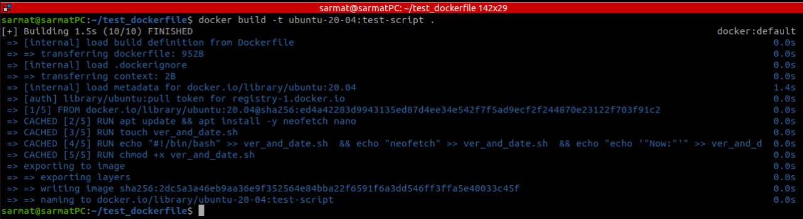
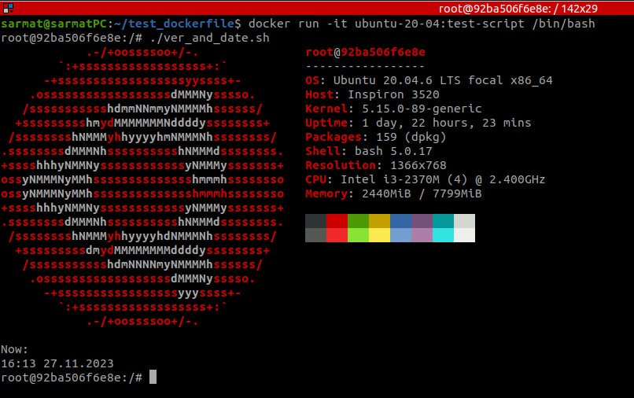
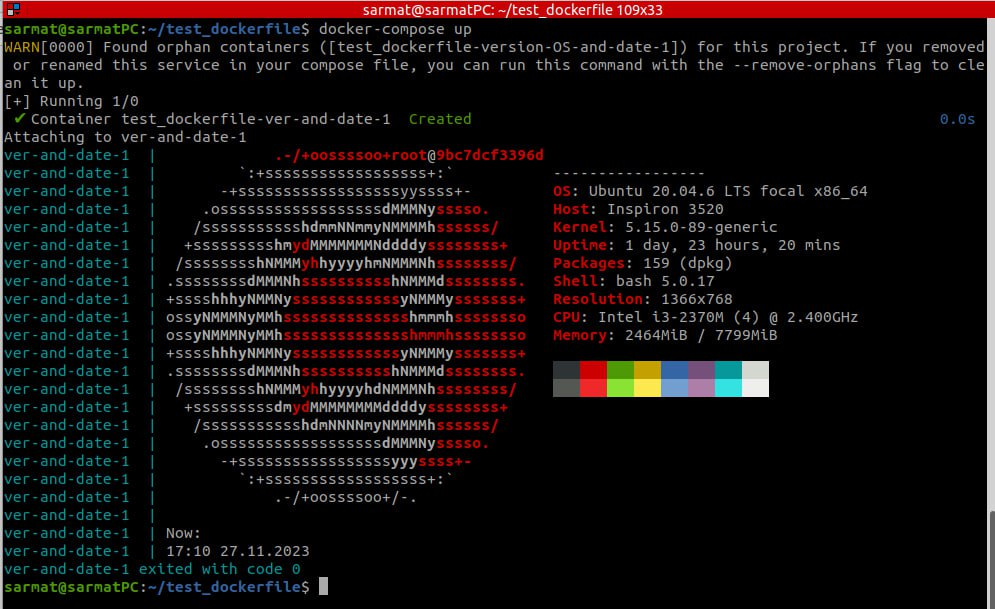

# Ход выполнения практической работы 5.7 

1. **Установка и настройка Docker и  Docker  Compose.**
2. **Создание файла Dockerfile, проверка сборки и запуска контейнера с скриптом.**
3. **Создание docker-compose.yml, проверка запуска.**

## 1. Установка и настройка Docker и  Docker  Compose.

Обновляем индекс пакетов:

```bash
sudo apt-get update
```

Установка дополнительных пакетов:
```bash
sudo apt-get install ca-certificates curl gnupg
```

Добавляем официальный GPG-ключ в Docker и изменяем права доступа к файлу docker.gpg:
```bash
sudo install -m 0755 -d /etc/apt/keyrings
curl -fsSL https://download.docker.com/linux/ubuntu/gpg | sudo gpg --dearmor -o /etc/apt/keyrings/docker.gpg
sudo chmod a+r /etc/apt/keyrings/docker.gpg
```
Добавляем репозиторий Docker в источники Apt:
```bash
echo \
"deb [arch="$(dpkg --print-architecture)" signed-by=/etc/apt/keyrings/docker.gpg] https://download.docker.com/linux/ubuntu \
"$(. /etc/os-release && echo "$VERSION_CODENAME")" stable" | \
sudo tee /etc/apt/sources.list.d/docker.list > /dev/null
```

Обновляем индекс пакетов:

```bash
sudo apt-get update
```
Установка  пакетов  **Docker**:

```bash
sudo apt-get install docker-ce docker-ce-cli containerd.io docker-buildx-plugin docker-compose-plugin
```

Для управления  Docker  от  имени  пользователя,  который  не  является  root, создадим группу docker:
```bash
sudo groupadd docker
```

Добавим пользователя в группу docker:
```bash 
sudo usermod -aG docker $USER
```

Активируем изменения группы:
```bash
newgrp docker 
```
Для установки последней версии **Docker Compose** перейдём по ссылке на GitHub: https://github.com/docker/compose/releases найдём "docker-compose-linux-x86_64", скопируем ссылку, которую вставим в следующую команду (на момент публикации версия Docker  Compose 2.23.2):

```bash
sudo curl -L "https://github.com/docker/compose/releases/download/v2.23.2/docker-compose-linux-x86_64" -o /usr/local/bin/docker-compose
```
Установим права на исполнение для файла docker-compose:

```bash
sudo chmod +x /usr/local/bin/docker-compose
```

Проверим установку Docker Compose, запросом версии:

```bash
docker-compose --version
```

---
## 2. Создание файла Dockerfile, проверка сборки и запуска контейнера с скриптом.

Создадим и отредактируем **Dockerfile**:

```bash
nano Dockerfile
```

В случае отсутствия будет скачан базовый образ ubuntu:20.04 в нём обновлены и загружены пакеты neofetch и nano. Создан файл скрипта ver_and_date.sh и в него вписаны инструкции по выводу версии ОС, данных ПК и текущей даты

```bash
# Из базового образа ubuntu:20.04 
FROM ubuntu:20.04
# Задаём переменную окружения, чтобы пользователь не участвовал в установке (выбор клавиатуры и прочее)
ENV DEBIAN_FRONTEND=noninteractive
# Установим необходимые пакеты
RUN apt update && apt install -y neofetch nano
# Создадим файл скрипта
RUN touch ver_and_date.sh
# Пропишем необходимые инструкции в файл скрипта
RUN echo "#!/bin/bash" >> ver_and_date.sh \
 && echo "neofetch" >> ver_and_date.sh \
 && echo "echo '"Now:"'" >> ver_and_date.sh \
 && echo "date +'"%H:%M %d.%m.%Y"'" >> ver_and_date.sh
# Дадим права для доступа на выполнение
RUN chmod +x ver_and_date.sh
# Зададим стартовую команду для контейнера
CMD ["bash"]
```

Соберём образ из данного Dockerfile с тегом **ubuntu-20-04:test-script** :

```bash
docker build -t ubuntu-20-04:test-script .
```



Запустим контейнер из образа **ubuntu-20-04:test-script**:

```bash
docker run -it ubuntu-20-04:test-script /bin/bash
```

В контейнере запустим файл скрипта:

```bash
./ver_and_date.sh
```



---
## 3. Создание docker-compose.yml, проверка запуска.

Создадим и отредактируем **docker-compose.yaml**:

```bash
nano docker-compose.yaml
```

Используем ранее собранный образ Dockerfile - ом **ubuntu-20-04:test-script** в качестве команды запуск скрипта:

```bash
version: '2'

services:
  ver-and-date:
    image: ubuntu-20-04:test-script
    command: ./ver_and_date.sh
```

Запустим с помощью Docker Compose:

```bash
docker-compose up
```



---

